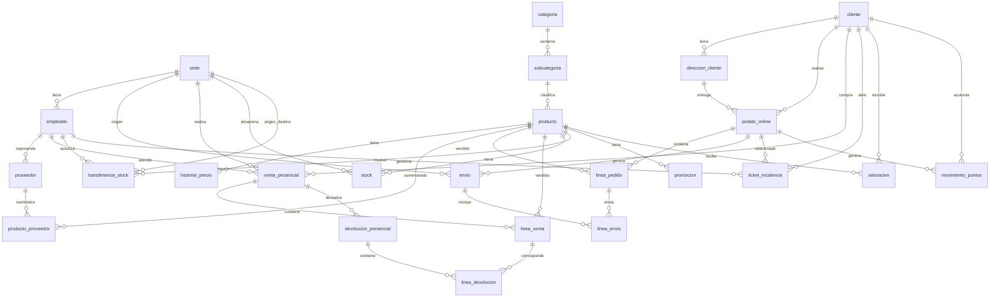

# 🛒 Proyecto NexShop Grupo SA

Diseño e implementación de una base de datos relacional para NexShop Group SA.

Bienvenido al repositorio oficial del proyecto final de bases de datos para NexShop Group SA. El proyecto desarrolla una base de datos para gestionar una empresa con tienda online y tiendas físicas.

---

# 👤 Información del Alumno

- **Nombre:** Emilio Anaya Verdugo
- **Curso:** 2º SMR 
- **GitHub:** https://github.com/emilio-av

---

# 🏢 Descripción de la Empresa

NexShop Group SA es una empresa dedicada al comercio minorista que combina una plataforma de venta online con varias tiendas físicas. La base de datos permite gestionar productos, clientes, proveedores, empleados, pedidos, ventas, envíos y devoluciones.

---

# 📊 Diagrama Entidad-Relación



---

# 📂 Estructura del Repositorio

```text
mi-proyecto-nexshop/
│── README.md
│
├── docs/
│   ├── memoria.md
│   └── modelo_relacional.md
│
├── sql/
│   ├── schema.sql
│   └── datos.sql
│
└── consultas/
    └── consultas.sql
```

---

# ⚙️ Cómo ejecutar

Crear la base de datos y ejecutar:

```bash
mysql -u root -p < sql/schema.sql
mysql -u root -p nexshop < sql/datos.sql
mysql -u root -p nexshop < consultas/consultas.sql
```

---

# 🛠 Tecnologías utilizadas

- MySQL 8
- SQL
- Git
- GitHub
- Laragon
- DBEAVER
